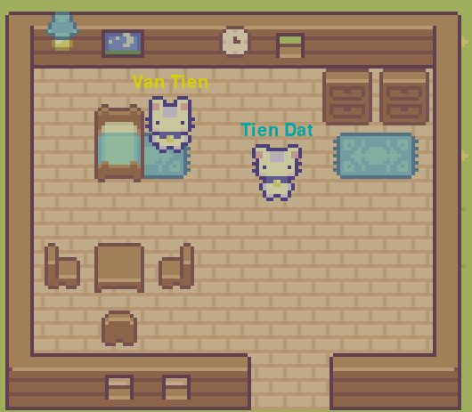
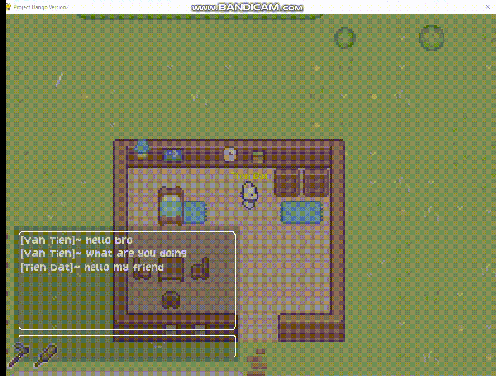

# Project Dango Version2

Client and server to play game **Project Dango Game**. It uses [pygame](https://www.pygame.org/news).

# Screenshots



- Framing


- Chat


- Trade


## Install
Requires: Python >=3.6.
To install, open a command prompt and launch:
```bash
pip3 install pygame
pip3 install pytmx

```

## Use
To launch a server:
```bash
socket_server = socket.socket(socket.AF_INET, socket.SOCK_STREAM)
server = socket.gethostbyname(socket.gethostname())
port = 12345
socket_server.bind((server, port))

```
To launch a client:
```bash
socket_client = socket.socket(socket.AF_INET, socket.SOCK_STREAM)
server = socket.gethostbyname(socket.gethostname())
port = 12345
socket_client.connect((server, port))
```

- HOST: IP address
- PORT: port number
- NUM_PLAYERS: number of players 2

HOST and PORT must be the same as the server.

## Systems and Engines

Here are the types of things I will be adding as a minimum viable product (alpha). Not too over the top but enough to cover the basics until more is added. Each section links to a project which will contain its sub-tasks within.

## To PLay The Game

- Step 1: Run server.py
- Step 2: Run game.exe and enjoy the game :>

### What does game have?
When an item is marked, it means that the basic foundation is in place but not necessarily complete. Items that have not been marked will be added in the future.

- [Player]
  - [x] Walking / pathfinding
  - [ ] Context-menu / Actions
  - [x] Inventory
- [User Interface]
  - [x] Chatbox (for players and actions)
  - [x] Character wear tab
  - [x] Overall look &amp; feel
- [NPC]
  - [x] Trading (Shops)
  - [ ] Dialog Interaction
- [Networking]
  - [x] Players see each other
  - [x] Non-playable characters
  - [ ] Player trading
  - [x] Items
- World
  - [x] Respawn system
  - [ ] Player versus Player
  - [ ] Resource skills
    - [x] Framing (Almost finished)
    - [ ] Fishing 

## Notice
Project Dango Version 2 is inspired by Sprout Valley with author Ze Frost and guided by YouTube channel Clear Code

Tileset, monsters, items, players by Ze Frost. · CC license
Main screen music by Clear Code. · CC license
River Land Fram map by VanTienKS    

## About Us 
[Email: vantiennst@gmail.com](https://vantienks.github.io/vantienks.githup.io/)

Email: ductindang1009@gmail.com

Email: tienhai488@gmail.com

## Overleaf

https://www.overleaf.com/3149154614jbgbhzcnjdmy#a89b8d
